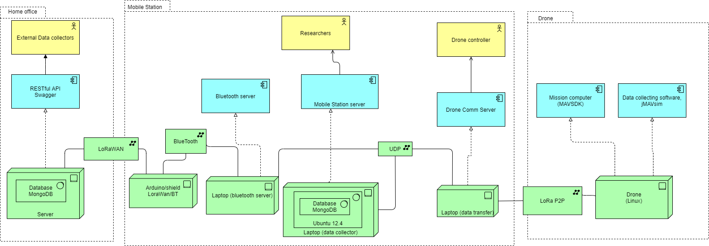

# Architecture

## Home Office

In the home office there is a server running a database and a restful Swagger API. From this API outside interests can (with permission) request data from the database that has been sent there by the mobile base. This API also receives data from the mobile base and writes it to the database. This data is received in the form of LoRaWAN.

## Mobile Base

### Drone Comm server

This server is responsible for sending orders to the drones and receiving the measurement data gathered from the drones via LoRaP2P. After data is received it will try to send it through a multicast socket to both the mobile station server and the bluetooth server.

### Mobile Station server

When this server receives measurement data from the Drone comm server it will translate it from bytes into a measurement object and store that in a MongoDB database. The server is connected to a webpage via springboot that reads the measurement data from the database.

### Bluetooth server

This server will receive data from the drone comm server and send it via bluetooth->Arduino->TTN to the home office database

## Drones

Since there are no actual drones provided to us we will use jMAVsim to simulate drones. This will run on a linux machine. Any data collected (generated) by the drone will be sent to the drone controller in the mobile base via LoRaP2P
