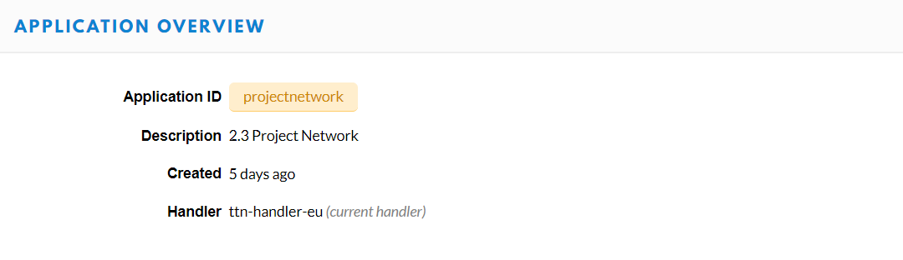
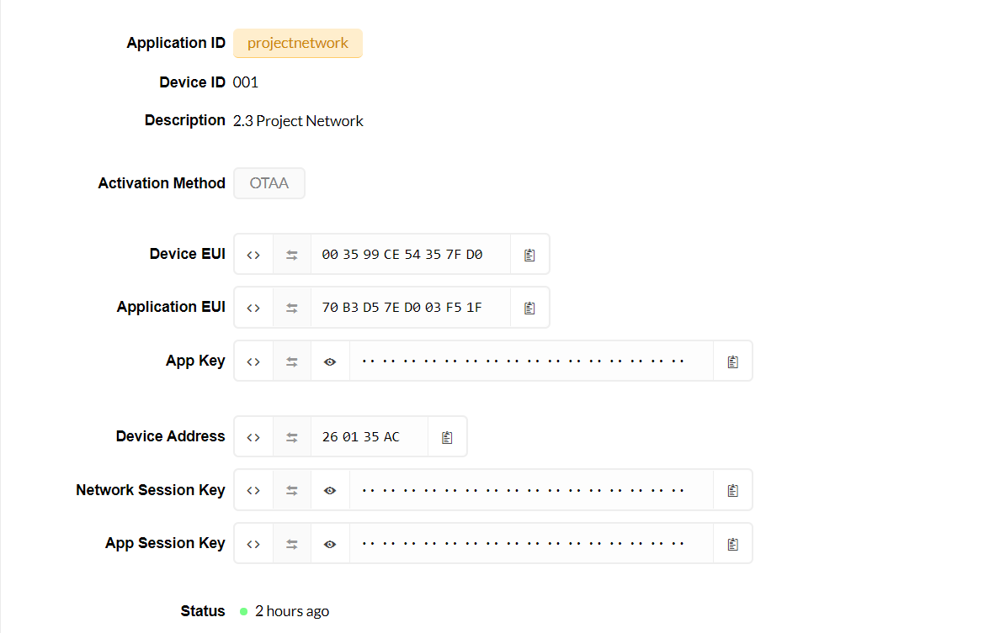
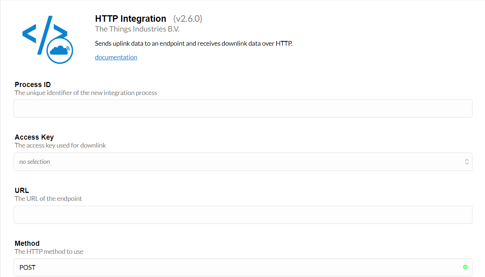

# Bluetooth module communication via arduino to TTN network
## Expected solution
- The bluetooth server (application) will send byte data to the arduino via bluetooth.
- From the arduino, the application will forward the bytes to the TTN network.
- On the TTN network, the data will be stored into a database by using POST request to an URL link of the local server.
## Final result
What has worked?
- Transfer bytes array from the bluetooth server to the ttn network via arduino uno using bluetooth module (hc-05).

What has not worked?
- Handle bytes data received from the arduino uno in the payload function (only show the raw bytes) on TTN network device to readable data.
- An integration from the ttn to a local server (using ngrok to expose port 8080 and swagger api) shows traffic but not update data to the server due to data not being handled in the payload of TTN network.

#Configuration

## Gateway connection
- In order to send data to the things network, registering a gateway in TTN network is an essential step.
First, we must provide the gateway's mac address and choose the type of frequency (which is channel 868100000, in this case).
- To have the gateway's mac address, you need to connect to it via Wifi or Ethernet connections. If the approach is connecting to Wifi, you may need to provide a password, which is "dragino+dragino" (for recent versions) for its Wifi (could be dragino-1fxxxx), named here is dragino-1f68d0.
  Another way is connecting Ethernet cable from the router to the Wan port on the gateway and another cable from Lan port on the gateway to your personal computer.
- Next step is log-in to http://10.130.1.1/ with a default username (which is root) and password (which is dragino).
- Go to LoraWAN configuration to gain the gateway ID to register on TTN network.  
  

- Next, we access *[The things network (TTN)](https://www.thethingsnetwork.org/)* to sign-up an account for testing purposes.
- Next step is log-in and go to the console to register a gateway. This is the result.
  
  
  

## Applications
- After having the gateway connected to TTN, we must register an application before we can send data to TTN. Go to console, choose Applications and add one.
  After provide all needed information, then we can expect a result could be like this.
  
  
- We have application at the moment, but we do not have any device to make it. Therefore, register one is necessary.
  Similar way provided as registration of applications, providing Device ID, Device EUI (recommended generating by TTN)
  and App Key (recommended generating by TTN). As a result, it could be shown like below.
  

- Now, it is time to test sending data to TTN network via the gateway. Note that there are two support modes, ABP and OTAA.
In this case, we chose OTAA over ABP. First, in OTAA mode the end devices are assigned a new DevAddr at establishing each new session. This allows them to move to different networks/clusters.
  Furthermore, OTAA end devices re-negotiate network parameters at establishing each new session, meaning you do not have to worry about them being misconfigured.
- In the code, provide your network session and application session keys, and device address from the device's overview on TTN network to the arduino ide. The source code is at "OTAA_Data_To_TTN.ino".
  
  
- After providing session keys, we need to set up the channel that maximum authorises in the EU according to the ‘1% duty cycle’-rule, which use the free 868 Mhz in the code and in the lora homepage (on http://10.130.1.1/cgi-bin/lora-lora.has) we set the frequency.
  
  
  

- We used a bluetooth module (hc-05) to receive data from a server and forward data to the TTN network through arduino uno.
We need to make the pin mapping from the bluetooth to the arduino by.
  
  | Bluetooth module (hc-05) | Arduino uno |
  | ----------- | ----------- |
  | RX        | 10       |
  | TX        | 11        |
  | VCC        | 5V        |
  | GND        | GND        |

- Note that bluetooth hc-05 has an 3.3 voltage regulator and arduino uno has 5 voltage of supply. Connecting them directly can
cause the damage to the bluetooth. That is why we need 2 resistors 2k and 1k standing between RX and GND pins
  
- To configure the bluetooth module connected to arduino in the code, we can declare by using Software Serial library and make it begin to run by begin() (in the parameter of the function, we provide the baud rate) in the setup() function.

  
  
- In the method sending data, we use the available() function from Software Serial of Bluetooth module to indicate a number of bytes will come to the arduino from the bluetooth module. Next, we use function read() to assign every coming byte to a local bytes array. In our RFC design, we know that the packet contains 17 bytes. So, we have a 17-byte array to forward to TTN network using LMIC. 

  
  
- Schedule the time to send data (in this case, we send every 15 seconds).
  
  

  
- Note that the ttn network provides low bandwidth, so the data should be in binary type. We need a payload format to display the message. However, it is hard for us now to interpret the raw data to readable data. So, we have to use the default payload on TTN.
  

- The result below is a sample of raw data we tried to interpret, but it is not correct compared to the message we would like to send.
  
  
- In the final state, our group have made a server using Swagger API to store data from the TTN network. An approach we made is using the HTTP integration.
  
  

- We provided ID for the integration and used the default key, and a URL which is a link to our local server.
Our result should look like this in the setting overview.
  
  

- To be specific, we use the link URL to a local server, that has been exposed to the internet by using [ngrok](https://ngrok.com/) service. Using command:
> ngrok http 8080

OR

> ngrok http http://localhost:8080/

- The command will expose the server on port 8080 to the internet
Note that in order to see the integration, we can use ngrok bat or ngrok inspect (on web interface http://127.0.0.1:4040) to observe the traffic coming to the server.

