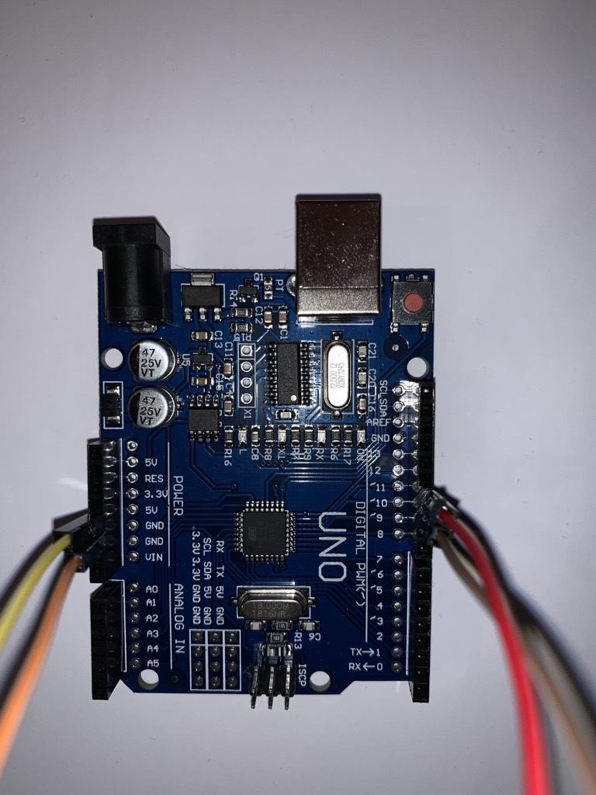

# Bluetooth connection 

##Abstract 
This part describes how we connect the HC-05 Bluetooth module to the Dragino LoRa Shield. 
We need Arduino Uno, HC-05 Bluetooth module, breadboard, 
jumper wires, 1k and 2.2k resistors and USB cable to connect Arduino to laptop.

   

##HC-05 Default settings
- Default Bluetooth name: "HC-05"
- Default Password: 1234 or 0000
- Default Communication: Slave
- Default Mode: Data Mode
- Data Mode Baud Rate: 9600, 8, N, 1
- Command Mode Baud Rate: 38400, 8, N, 1
- Default firmware: LINVOR

##HC-05 Technical Specifications
- Serial Bluetooth module for Arduino and other microcontrollers
- Operating Voltage: 3V to 6V (typically +5V)
- Operating Current: 30mA
- Range: <100m
- Works with Serial communication (USART) and TTL compatible
- Follows IEEE 802.15.1 standardized protocol
- Uses Frequency-Hopping Spread spectrum (FHSS)
- Can operate in Master, Slave or Master/Slave mode
- Can be easily interfaced with Laptop or mobile phones with Bluetooth
- Supported baud rate: 9600, 19200, 38400, 57600, 115200, 230400, 460800

##HC-05 pins
- Enable / Key is used to toggle between Data Mode (set low) and At command mode (set high). By default, it is in Data mode
- VCC powers the module. Connects to +5V Supply data voltage
- GROUND pin of module, connects to the system ground
- TX - transmitter transmits serial data. Everything received via Bluetooth will be given out by this pin as serial data
- RX - receiver receives serial data. Every serial data given to this pin will be broadcasted via Bluetooth
- STATE is connected to on board LED, it can be used as a feedback to check if Bluetooth is working properly
- LED indicates the status of Module:
    - blink once in 2 sec: Module has entered Command Mode
    - repeated blinking: waiting for connection in Data Mode
    - blink twice in 1 sec: connection successful in Data Mode
- BUTTON used to control the Key/Enable pin to toggle between Data and command Mode

##Connections 
HC-05 module is connected to the breadboard and then to the Arduino using the jumper wires. 

- The RX pin on HC-05 is connected to TX pin 10 on Arduino
- The TX pin on HC-05 is connected to RX pin 11 on Arduino
- GND pin on HC-05 is connected to GND pin on Arduino
- VCC pin on HC-05 is connected to 5V pin on Arduino
  

In order to keep the voltage flow safe, we use the resistors:
  - 1K resistor provides connection between the RX on HC-05 and TX on Arduino
  - 2.2K resistor provides safe connection between the GND on HC-05 and Arduino 

Arduino is then connected to the laptop via the USB cable in this case. Unfortunately, we cannot connect bluetooth module remotely with any bluetooth-based devices. 

This simple program is how bluetooth module connect to the PC and turn into AT command mode. However, it did not work as we expected.
So, with support from our teacher, we can only send AT commands to HC-05 module by pressing its button to keep it in AT command mode.

Here is the results after we demand HC-05 to respond to commands:
- Respond with OK: AT
- Respond with name: AT+NAME
- Respond with version: AT+VERSION
- Respond with password (default: 1234): AT+PSWD
- Respond with address: AT+ADDR
- Respond with connected mode (0: connect fixed address, 1: connect any address, 2: slave-loop): AT+CMODE
- Respond with role (0: slave, 1: master, 2: slave-loop): AT+ROLE

