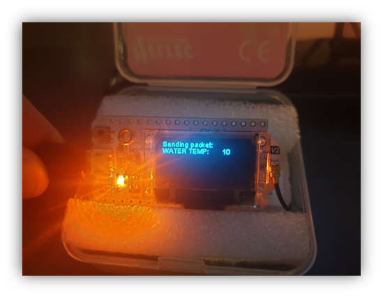
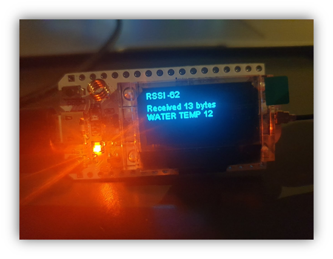

# Lora P2P
## Heltec ESP32
The device we were supplied with for the project is the Heltec esp32. It is capable of Communication using WIFI, LoRa, Serial, and BluetoothLowEnergy. For this POC we will use the LoRa functionality.

## Settings
- BAUD rate: 115200
- Display: enable
- LoRa: enable
- Serial: enable
- Band: 868Mhz

## Setup
For this poc you need at least 2 Heltec Esp32 devices. One will be programmed as the "sender" and one will be the "receiver" the data we will be sending is a simple hello string and a counter which increments each time the loop runs.

The code for the Sender is similar to the Receiver in the setup method. They both initializa the heltec device by calling heltec.begin(). this method init's the display, serial, lora and sets the Band we use for communication. The band is an important setting because depending on where you are in the world it may be illegal to use certain bands. 868 is the band used in Europe so we will use this. the receiver calls a method called LoRa.receive(), this starts the process of getting lora packets.

## Loop
for the main loop the receiver simply checks if a new lora packet has been received and calls a method cbk(int packetsize), which transforms the data into a string. This is then displayed on the screen using proprietary methods the heltec has for displaying data on screen. Heltec.display->drawString().

For the main loop on the sender it is a bit different we have a counter which is incrementing each pass through the loop. First we need to setup the LoRa antenna to the correct dB. with 20dB being the maximum on this device. The higher the dB the more power is injected and the farther the data will go. We are using LoRa.beginPacket() to signify the beginning of a packet. And LoRa.Print() to add strings and ints to the packet. Once LoRa.endPacket is called the LoRa data is sent. then we turn on the LED for a second to alert the user that it is transmitting, and increment the counter.

DRONE:

MobileBase:

