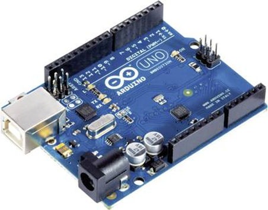
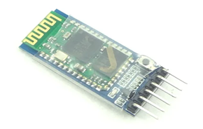
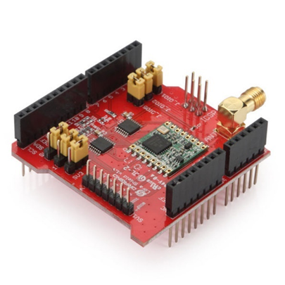

# Arduino/Dragino Research

## What is Arduino?
Arduino is an open-source electronics platform based on easy-to-use hardware and software. Arduino boards can interact with buttons, LEDs, motors, speakers, GPS units, cameras, internet, and even smartphone or TV.[1] You can tell the board what to do by sending a set of instructions to the microcontroller on the board. To do so, Arduino programming language, and the Arduino software based on Processing are used. [2]

Different Arduino boards are affordable and can be used for wide range of projects. The code is written in a special IDE and can be expanded with C++ libraries.

Possible projects that can be built with Arduino boards include various types of robots, monitoring systems, security systems, or different kind of displays.

## Arduino and Bluetooth
One drawback of Arduino is that it needs to be connected to the computer using USB cable to upload the code as it doesn't have any onboard support for wireless communication. Sometimes it's difficult to connect the board to a PC if the project is fixed somewhere. The solution to this problem is to program Arduino wirelessly. Wireless programming or OTA (Over the Air) Programming can be done easily in ESP8266 and ESP32 as they have Wi-Fi support inbuilt on board. But in Arduino there is need to use Bluetooth module to program it wirelessly. It's the easiest way for wireless communication, and many interesting projects have been built with it, like Bluetooth Controlled Robot, Bluetooth Voice Control or Bluetooth Home Automation. We need several components in order to do it: Arduino Uno, HC-05 Bluetooth module, jumper wires, 1K, 2.2K resistors, Capacitor (0.1uF), power adapter and breadboard. [3]

HC-05 is a Bluetooth Serial Port Protocol module, especially designed for wireless communication between microcontrollers. It provides switching mode between master and slave mode configuration and communicates through Serial Communication at 9600 baud rate, which makes it easy to interface with a controller. HC-05 module works on 3.3V, but we can connect it to 5V supply voltage because the module comes with onboard 5V to 3.3V regulator.

Step by step install instructions for HC-05 module can be found online. At the following link:

https://www.instructables.com/HC05-Bluetooth-Module-Voltage-Divider/

The module can then be controlled either by Android phone or pc.  

## What is Dragino?
hardware, specialized in Linux IoT/VOIP, Arduino add-on boards and LoRa modules and gateways.

### What is the Dragino Project
Dragino is a manufacturer of IoT What is the Dragino Project?
A: The Dragino is an OpenWrt appliance project lets you embed Linux for your MCU (microcontroller-unit) project. It is a low cost, open hardware Linux motherboard for microcontrollers. It runs Linux using OpenWRT and has full Ethernet and 802.11b/g/n Wi-Fi capabilities.
The GOAL of the Dragino project is to solve the microcontroller connectivity problem and greatly enhance microcontroller products such as the Arduino.
The Dragino's can be used in remote control of robots, data logging, web applications for data presentation, mesh networking over Wi-Fi and many more.
The Dragino is open software & open hardware design released under the Creative Commons License. The modular Dragino design also enables rapid development cycles for commercial products – just design a custom microcontroller board and you have a turn-key commercial MCU/embedded Linux product. [5]

## What is the Dragino LoRa Shield
The Dragino LoRa Shield is a long-range transceiver on an Arduino shield form factor and based on Open-source library. The LoRa Shield allows the user to send data and reach extremely long ranges at low data-rates. It provides ultra-long range spread spectrum communication and high interference immunity whilst minimizing current consumption.

The LoRa Shield based on SX1276/SX1278 targets professional wireless sensor network applications such as irrigation systems, smart metering, smart cities, smartphone detection, building automation, and so on.

Using Sentech’s patented LoRa™ modulation technique the LoRa Shield can achieve a sensitivity of over -148dBm using a low-cost crystal and bill of materials. The high sensitivity combined with the integrated +20 dBm power amplifier yields industry leading link budget making it optimal for any application requiring range or robustness. LoRa™ also provides significant advantages in both blocking and selectivity over conventional modulation techniques, solving the traditional design compromise between range, interference immunity and energy consumption.

These devices also support high performance (G)FSK modes for systems including WMBus, IEEE802.15.4g. The LoRa Shield deliver exceptional phase noise, selectivity, receiver linearity and IIP3 for significantly lower current consumption than competing devices.
It runs on the following frequencies: 433, 470, 868, 915/920Mhz and uses a standard antenna to boost signal strength.
It connects directly onto the Arduino board. [4]

## Arduino IDE
https://www.digikey.com/en/maker/blogs/2018/how-to-get-started-with-arduino

The link above is a step-by-step guide to familiarizing yourself with the Arduino Uno and IDE. The hello world program is included to get you started with programming using the Arduino IDE.
The Arduino IDE uses the C++ programming language.

## Arduino and LoRa Shield
Video: https://www.youtube.com/watch?v=bfSxdOnqfik

Article/code: https://miliohm.com/lora-shield-arduino-tutorial/

the video and article linked above are guides on how to use the LoRa Shield module with an Arduino. These can be referenced when we are implementing the Arduino Lora Shield.

## Sources
| Description | Source |
| --- | --- |
| About Arduino |[1] https://learn.sparkfun.com/tutorials/what-is-an-arduino/all   |
| About Arduino |[2] https://www.arduino.cc/en/Guide/Introduction |
| HC-05 Bluetooth module | [3] https://www.instructables.com/Setting-Up-Bluetooth-HC-05-With-Arduino/ |
| Arduino Module | https://en.wikipedia.org/wiki/Arduino |
| Dragino Repo | https://github.com/dragino |
| Dragino Website | [5] https://www.dragino.com/support/faqs.html |
| LoRa Shield | [4] https://wiki.dragino.com/index.php?title=Lora_Shield |
| Programming Arduino and bluetooth | https://circuitdigest.com/microcontroller-projects/how-to-program-arduino-wirelessly-over-bluetooth |

