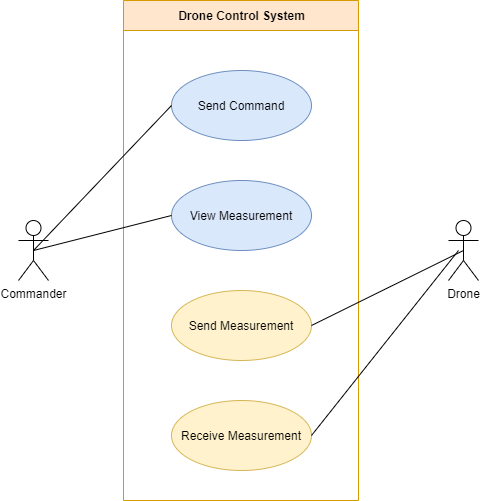
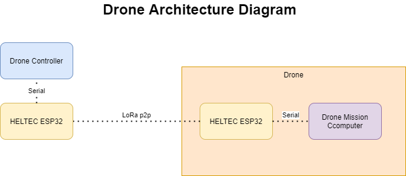
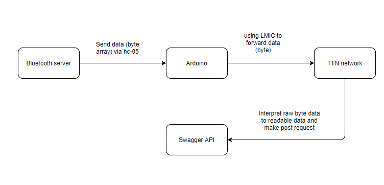

# Technical Documentation

## System Description

### Sequence diagram
Sequence diagram shows data flow in our system. 

An user can make a command via Drone Controller (web interface for different commands to navigate drone). The Drone controller forwards those via LORA P2P to Drone. Drone collects data and then, sends collected data via LoRA P2P back to Drone controller server.
Drone controller sends those data to mobile station and home station, which receive this data as byte array. This is then decoded based on our RFC. In mobile station, data are saved to database and also analyzed and displayed on web application connected to server. 
In home station, data are also saved into database and can be accessed via endpoints (generated with Swagger).

Home station also listens on data that can be send to it via LoRaWAN from another drones and then forwarded to mobile station and drone controller via bluetooth.

### Use case diagram

### RFC

### Drone
The drone consists of two parts: A mission computer and a Drone (Simulator) in our case. The Drone is simulated using PX4 and MavSDK and communicates to the mission computer using MavLink API. The mavlink API can use serial, Wi-Fi and UDP to transmit data between Drone and Mission Computer. The mission computer is running a virtual machine with Ubuntu linux as OS.

### Drone controller

The function of the drone controller is to send and receive information using LoRa P2P to and from drones. The drone can then respond with a packet of measurements that was requested on the webapp. The controller knows that it needs to send a lora packet because it gets a UDP message with a request in byte form. These bytes are made up in such a way (shown in the RFC protocol) that the receiver can break the message down into individual bytes and extract data that way.

The method of sending data to the drone is via LoRa P2P, which is made possible by our Heltec ESP32 device. It uses RF signals which help it travel much longer distances than WI-FI but using a lot less power. However, this form of transmitting data is limited based on where you are. Users must abide to the 1% duty cycle rule, a rule which stipulates that you can only send a certain amount of data per time frame. Here in Europe we use the 868MHz-915MHz bands, and these are strictly regulated to ensure fair use of bandwidth. Below the maximum data rate is explained further along with actual figures for fair use.

#### Airtime calculation
For the heltec device we are using the DR0 SF12bw125 data rate.(SF stands for spreading factor.) Which has a maximum of 64 bytes per packet. There is also a limit to the uplink time depending on packet size.
For our specific case we have a payload of 17 bytes per packet. meaning we are limited to the following:
- Airtime: 1646.6 ms
- 1% max duty cycle: 164.7 sec between packets. 21 msg/hour
- Fair access policy: if transmitting for 24 hours there must be t least 0.8 hours between each msg.
  Source: https://avbentem.github.io/airtime-calculator/ttn/eu868/17,12

### UDP Programming Overview

### Drone controller Server
The main function is to realize UDP transmission and send drone message data (fake messages) to MobileStationServer and BluetoothServer in the form of Multicast. At the same time it will also listen for messages from BluetoothServer, as well as listen to the serial port for incoming packets from the LoRa device. There packets are coming from the drones LoRa device. The Drone control Server is also listening for any Serial input using ComPortListener.java This class implements SerialPortDataListener class, and means that it can get incoming data from serial and pass it on to the MobileStation/Database. Incoming data is passed as a SerialPortEvent from which the bytes containing Drone Measurements can be extracted.

### Bluetooth Server
The main function is to realize UDP transmission. After receiving the data from dronecontrollerServer, it transmits the data to HC-05 through Bluetoothmanager. Similarly, when the data from HC-05 is received, the data will be sent to MobileStationServer and dronecontrollerServer at the same time in the form of Multicast.
In the bluetooth manager, the data packet will contain 17 bytes. It will be transferred to the arduino uno (connected to the bluetooth module hc-05). In the arduino application, the data will be store locally and forward to the TTN network. On the TTN network, the data will integrate or update to a server by HTTP integration using POST requests.

### Database
***MongoDB***
As our database, we chose MongoDb. Because of not access to internet, database has to be stored locally, so we didn't go with a cloud storage database. Also, Mongodb is very easy to access data (also with GUI Compass) and change them. This benefitial for us, because we were expecting our design of database migh need to be edited. Data look alike JSON, its easy to display and also using Mongoose its very handy to manipulate them as JavaScript objects, if thats needed in server. For mobile base, we choose Springboot, which Springboot application can be created with Mango integration.
It is going to be connected to a server, which is accessible by an application. 
DB is running in both Home Station Server and Mobile Station Server on port 27017.

### Home Station Server
Home station receives drone's collected data via Bluetooth. Data are stored into the database and can be displayed via accessing endpoints from server.
Database uses **Mongoose** . Mongoose is an Object Data Modeling library. We used this to connect our server which is in NodeJS to connect with MongoDB. 
We install this to be able to connect MongoDB with a programming language. It also provides a lots of functionality. 
It maps data that are received into JavaScript objects,
that can be helpful for us to then handle the data in the way we want to use in JS side of things.
**Swagger** is used for generating api documentation and it is also helpful to test the endpoints and see the results via using web browser.
Server runs on port 3000. 

### Mobile Station Server 
Mobile station server is connected to database, which saves and receives data from drone. Mobile station receives data from Bluetooth. Those data are received as byte array based on our RFC protocol and are decoded in Mobile Station. Collected data are saved to the database and can also be displayed graphically using web interface. Besides that, mobile station server includes web interface which can be used to send commands to a drone.

Mobile station is a Springboot server with MongoDB. Server runs on port 8080.

The mobile station server has a web application that is built with Java, HTML, CSS and a little bit of JavaScript. We’ve made use of Google Graphs to get a overview of all data, It’s also possible to search for information.

MobileStationServer includes following directories: **controllers**, **model**, **repositories** and **resources**.

**UDP**：Listen for messages from BluetoothServer and DRonecontrollerServer.

**controllers** directory has endpoints for our webserver (GET /, GET /drone).
GET / displays graf visualisation for each measurements and GET /drone displays map, where ...

**resources**: connection with the database is accomplished by specifying database info in application.properties (resources dir) and templates dir includes frontend for our endpoints.

**model**: includes Measurement class, which represents our collection from database in Java code, so we can manipulate and display the data.

### RFC data packets

#### For the measurements taken:

| bit index | Content | Value  | Explanation |
| --- | --- | --- | --- |
|   0 to 3   | Drone id| 0 - 10 |  The drone id that the message is being sent to or coming from |
|   4 to 7   | Datatype of the message | 0 - 5 | The number that represents the datatype in the payload of message |
|   8 to 71  | GPS coordinates | -90000.0000 ~ 90000.0000 / -180000.0000 - 180000.0000 | Latitude and Longitude values |
|  72 to 103 | Unix time | 0 - 2147483647 | The unix time when message was sent |
| 104 to 135 | Data | -99999.99999 - 99999.99999 | The payload of the message |

#### For the drone command:

First 4 bits: DroneID

Next 4 bits: Datatype

Next 64 bits: Coordinates

Total bits: 72, 9 bytes

